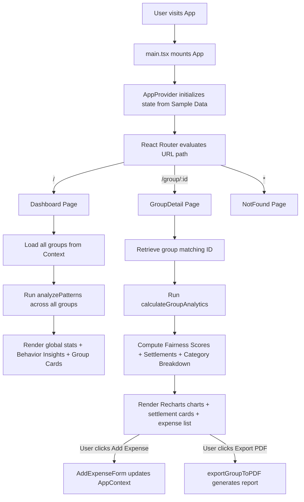
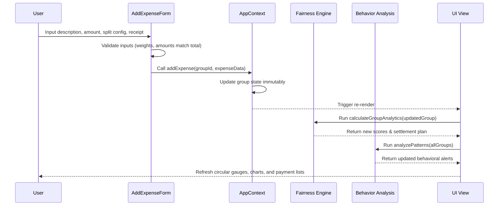
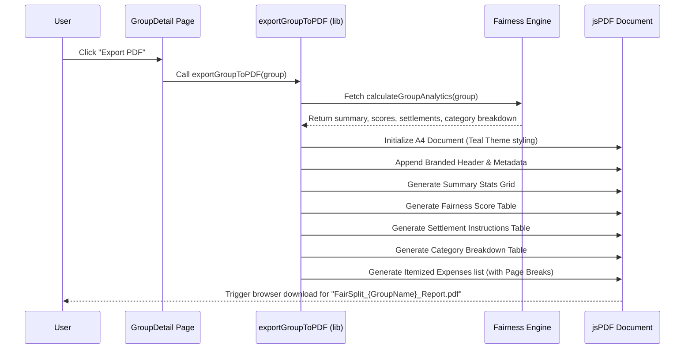

# ⚖️ FairSplit — Smart Group Expense Fairness Analyzer

<div align="center">


</div>

---

## 📖 Table of Contents

- [🔍 Project Overview](#-project-overview)
- [✨ Key Features](#-key-features)
- [🛠️ Tech Stack](#️-tech-stack)
- [📂 Code Structure & Folder Organization](#-code-structure--folder-organization)
- [🔄 Workflow & Execution Flow](#-workflow--execution-flow)
  - [1. Application Lifecycle Flow](#1-application-lifecycle-flow)
  - [2. Expense Processing Pipeline](#2-expense-processing-pipeline)
  - [3. Greedy Settlement Optimizer Flow](#3-greedy-settlement-optimizer-flow)
  - [4. PDF Report Generation Flow](#4-pdf-report-generation-flow)
- [🧮 Core Algorithms](#-core-algorithms)
  - [Fairness Score Formula](#fairness-score-formula)
  - [Greedy Transaction Minimization](#greedy-transaction-minimization)
  - [Behavioral Insights Rules](#behavioral-insights-rules)
- [🚀 Setup & Installation](#-setup--installation)
  - [Prerequisites](#prerequisites)
  - [Installation Steps](#installation-steps)
  - [Available Scripts](#available-scripts)
- [💡 Usage Guide](#-usage-guide)
- [🧪 Testing Strategy](#-testing-strategy)
- [📄 Documents](#-documents)

---

## 🔍 Project Overview

Traditional expense-splitting applications answer one simple question: **"Who owes whom how much?"**
**FairSplit** goes beyond that. It is designed to answer: **"Is the spending and consumption distribution in this group actually fair?"**

When roommates, travel groups, or event planners share expenses, perception bias often leads to friction. FairSplit introduces a quantitative **Fairness Score Engine (0–100)** to measure contribution equity. It analyzes spending behaviors, alerts groups to imbalances (such as consistent over-payers or free-riders), provides transaction-optimized settlement plans, and exports detailed summaries directly to PDF reports.

> [!NOTE]
> FairSplit is a fully client-side single-page application (SPA). All computations, charts, theme logic, and PDF reports are generated directly in the browser, making the app private, serverless, and extremely fast.

---

## ✨ Key Features

- **⚖️ Fairness Score Engine**: Computes individual and group fairness metrics based on deviations between how much a member paid and how much they benefited.
- **🤖 Behavioral Insights**: Identifies over-payers, free-riders, dominant payers, category spend spikes, and large single transactions, rendering visual feedback cards.
- **💡 Smart Settlements**: Utilizes a greedy graph minimization algorithm to reduce the total number of peer-to-peer transactions required to clear balances.
- **📈 Rich Visualizations**: Incorporates circular SVG fairness gauges, contribution vs. benefit bar charts, and category breakdown pie charts using Recharts.
- **📄 Client-Side PDF Export**: Generates professional PDF reports with formatted summary tables, settlement instructions, and full itemized expense lists.
- **🧾 Receipt Attachments**: Allows attaching proof-of-purchase images (handled via local file blob URLs) with an integrated lightbox preview.
- **🌓 Adaptive Theme**: Support for Dark/Light mode with persistence (prefers-color-scheme detection saved to `localStorage`).

---

## 🛠️ Tech Stack

| Layer | Technology | Purpose |
| :--- | :--- | :--- |
| **Core UI** | React 18.3.1 | Component architecture and state management |
| **Language**| TypeScript 5.8 | Type safety and domain models |
| **Styling** | Tailwind CSS 3.4 | Utility-first responsive design |
| **Build Tool**| Vite 5.4 | High-performance bundling and sub-second HMR |
| **Routing** | React Router DOM 6 | Client-side page navigation |
| **UI Kit**   | shadcn/ui + Radix | Accessible components (dialogs, select, tooltips) |
| **Charts**   | Recharts | Interactive visualizations (bar and pie charts) |
| **Animation**| Framer Motion | Fluid transitions and circular gauge animations |
| **PDF Library**| jsPDF + AutoTable | Client-side PDF formatting and generation |
| **Testing**  | Vitest | Fast unit testing |

---

## 📂 Code Structure & Folder Organization

The project codebase follows a clean separation of concerns, grouping logic, presentation, components, and assets.

```
fair-share-tracker-main/
├── public/                    # Static assets
│   ├── favicon.ico            # Site favicon
│   └── robots.txt             # Search engine crawler instructions
├── src/                       # Main application source
│   ├── components/            # Reusable UI components
│   │   ├── ui/                # shadcn/ui primitive design tokens (buttons, cards, inputs)
│   │   ├── AddExpenseForm.tsx # Modal form for adding/editing expenses with split configurations
│   │   ├── CreateGroupForm.tsx# Multi-step wizard to initialize a new group and members
│   │   ├── FairnessGauge.tsx  # Animated SVG circular gauge for displaying 0-100 scores
│   │   ├── InsightsPanel.tsx  # Dashboard list rendering behavioral patterns
│   │   ├── MobileLayout.tsx   # Responsive shell offering mobile bottom navigation
│   │   ├── NavLink.tsx        # Styled link wrapper for navigation tabs
│   │   ├── SettlementList.tsx # Rendered payment details for debt clearing
│   │   └── ThemeToggle.tsx    # Sun/moon toggle button managing dark/light modes
│   ├── context/               # Global state management
│   │   └── AppContext.tsx     # Context provider managing groups, expenses, and CRUD operations
│   ├── hooks/                 # Custom React hooks
│   │   ├── use-mobile.tsx     # Mobile viewport width detection hook
│   │   └── use-toast.ts       # Standard shadcn notification toasts
│   ├── lib/                   # Core business logic and helpers
│   │   ├── behavior-analysis.ts# Rule engine analyzing spend patterns and alerts
│   │   ├── export-pdf.ts      # Configured layout parameters generating jsPDF reports
│   │   ├── fairness-engine.ts # Math models for balances, scores, and settlements
│   │   ├── sample-data.ts     # Initial seed dataset representing trips, shared houses, etc.
│   │   ├── types.ts           # Unified TypeScript definitions (Group, Expense, Member)
│   │   └── utils.ts           # Style merging and formatting helpers
│   ├── pages/                 # Layout views mapped to routes
│   │   ├── Dashboard.tsx      # Main workspace: cumulative stats, cross-group insights, group list
│   │   ├── GroupDetail.tsx    # Specific group workspace: charts, settlements, expense logs
│   │   └── NotFound.tsx       # 404 error fallback screen
│   ├── App.css                # Global CSS overrides
│   ├── App.tsx                # App routes config, provider wrappers
│   ├── index.css              # Custom Tailwind tokens, glassmorphism utilities, and typography imports
│   ├── main.tsx               # DOM mount entrypoint
│   └── vite-env.d.ts          # Vite build environment types
├── eslint.config.js           # Linting configurations
├── package.json               # Dependencies and build script configs
├── tsconfig.json              # Compiler options
├── vite.config.ts             # Vite server and bundler settings
└── vitest.config.ts           # Test environment configurations
```

---

## 🔄 Workflow & Execution Flow

### 1. Application Lifecycle Flow

When a user opens FairSplit, the routing mechanism mounts the pages, fetches state, computes financial metrics, and passes them to components:



### 2. Expense Processing Pipeline

Adding or modifying an expense triggers a downstream state update and recalculation:



### 3. Greedy Settlement Optimizer Flow

This optimization reduces transaction counts from complex multiple debts to a minimal set:

```mermaid
graph TD
    A[Get member balances: paid - benefited] --> B[Filter members with non-zero balances]
    B --> C[Divide into Debtors (balance < 0) & Creditors (balance > 0)]
    C --> D[Sort Debtors descending by debt amount]
    C --> E[Sort Creditors descending by credit amount]
    
    D --> F{Are both lists non-empty?}
    E --> F
    
    F -->|Yes| G[Match largest debtor with largest creditor]
    G --> H[Determine transfer amount = min(debt, credit)]
    H --> I[Create Settlement transaction record]
    I --> J[Subtract transfer amount from debtor's and creditor's balances]
    J --> K[Remove members from lists if their remaining balance = 0]
    K --> F
    
    F -->|No| L[Return transaction-minimized Settlement List]
```

### 4. PDF Report Generation Flow

Reports are constructed and downloaded completely within the client's browser sandbox:



---

## 🧮 Core Algorithms

### Fairness Score Formula

Individual fairness is determined by comparing a member's actual payment against their consumed benefits:

$$\text{Net Balance}_i = \text{Total Paid}_i - \text{Total Benefited}_i$$

$$\text{Deviation}_i = \frac{|\text{Net Balance}_i|}{\text{Average Per Person}}$$

$$\text{Fairness Score}_i = \max\left(0, 100 - \text{Deviation}_i \times 50\right)$$

* A **0% deviation** yields a score of **100** (perfect equity).
* A **deviation equal to the group average** yields a score of **50** (concerning imbalance).
* A **deviation of 200% or greater** yields a score of **0** (extreme imbalance).

---

### Greedy Transaction Minimization

To settle the group's debts with the fewest transactions, the engine separates debtors from creditors, sorts them by absolute values, and matches them. By paying off the largest debt first against the largest credit, we achieve a transaction complexity of $O(M \log M)$ (where $M$ is the number of members), yielding a clean settlement plan.

---

### Behavioral Insights Rules

The pattern analysis module executes six rules to trigger alerts:

1. **Over-payer** (Warning 💸): `memberPaid > avgPerPerson * 1.4` and `netBalance > avgPerPerson * 0.3`.
2. **Free-rider** (Alert 🚩): `memberBenefited > avgPerPerson * 0.5` and `memberPaid < avgPerPerson * 0.2`.
3. **Dominant Payer** (Info 👑): A single member covers $>60\%$ of total expenses in a group with $\ge 3$ expenses.
4. **Well-Balanced** (Success ✅): All members maintain a fairness score $\ge 80$ in a group with $\ge 3$ expenses.
5. **Category Spike** (Info 📊): Spending in a single category accounts for $>60\%$ of a group's total spending.
6. **Large Expense** (Warning ⚠️): A single expense makes up $>50\%$ of the group's total cost in a group with $\ge 3$ expenses.

---

## 🚀 Setup & Installation

### Prerequisites

Ensure you have the following installed on your machine:
- **Node.js** (v18.0.0 or higher recommended)
- **npm** (v9.0.0 or higher) or **Bun** package manager

### Installation Steps

1. **Navigate to the Project Directory** (where `package.json` is located):
   ```bash
   cd fair-share-tracker-main/fair-share-tracker-main
   ```

2. **Install Project Dependencies**:
   ```bash
   npm install
   ```

3. **Start the Local Development Server**:
   ```bash
   npm run dev
   ```

4. **Open in Browser**:
   Open [http://localhost:8080](http://localhost:8080) to run and interact with the application.

---

### Available Scripts

In the project root, you can execute the following commands:

- **`npm run dev`**: Launches the local development server with Vite (defaults to port `8080`).
- **`npm run build`**: Compiles the source files and builds an optimized production bundle inside the `dist/` directory.
- **`npm run preview`**: Runs a local web server to preview the built assets in `dist/`.
- **`npm run lint`**: Inspects files using ESLint rules.
- **`npm test`**: Runs the unit test suite using Vitest.

---

## 💡 Usage Guide

### 1. Group Creation
- Click **"New Group"** (or tap the floating `+` button in mobile layouts).
- Choose a name and a context mode (**Trip**, **Hostel**, **Event**, or **Shared Living**).
- Add members (minimum of 2 required) and save.

### 2. Expense Logging
- Tap on your group, click **"Add Expense"**.
- Input description, amount, date, and category.
- Designate who paid, and select a **Split Type**:
  - **Equal**: Divides the total cost equally among selected members.
  - **Custom**: Allows inputting specific currency amounts for each member.
  - **Weighted**: Distributes costs based on multipliers (e.g. `1.5x` vs `1.0x`).
- Optional: Attach a receipt image.

### 3. Review Analytics
- Use the circular **Fairness Gauges** to inspect members' scores.
- View the **Balances** and **Category Breakdown** charts.
- View optimized suggestions in the **Settlement List** to pay off debts.

### 4. PDF Generation
- Tap the **PDF Export** download icon in the group header.
- A formatted PDF report is compiled and downloaded to your downloads folder instantly.

---

## 🧪 Testing Strategy

The test suite covers algorithmic correctness, business rules, and UI responsiveness.

- **Unit Testing (Vitest)**: Tests core computations in `fairness-engine.ts` (e.g. verifying that split calculations equal total expense values and settlements balance out to zero) and `behavior-analysis.ts` (verifying triggers for patterns).
- **Manual Verification**: Run `npm run build` to ensure type-checking and bundling succeed. Toggle the theme (light/dark) to verify style persistence in `localStorage`.

Run unit tests via command line:
```bash
npm test
```

---

## 📄 Documents

- [Architecture Design Document](architecture.md)
- [Complete Project Documentation](projectdocumentation.md)

---

<div align="center">

**FairSplit — Smart Expense Tracker & Fairness Analytics**

[⬆ Back to Top](#-fairsplit--smart-group-expense-fairness-analyzer)

</div>
