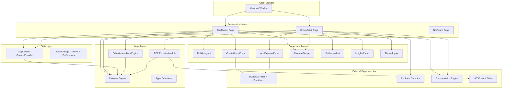
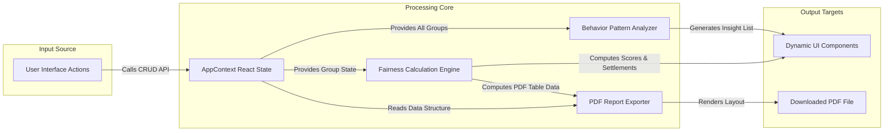
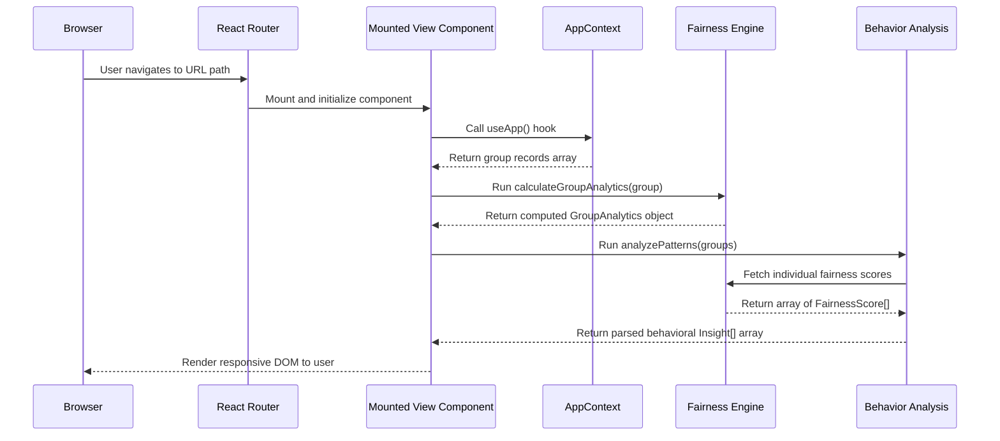
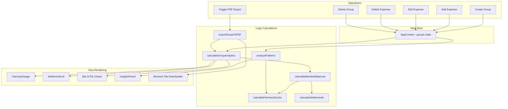
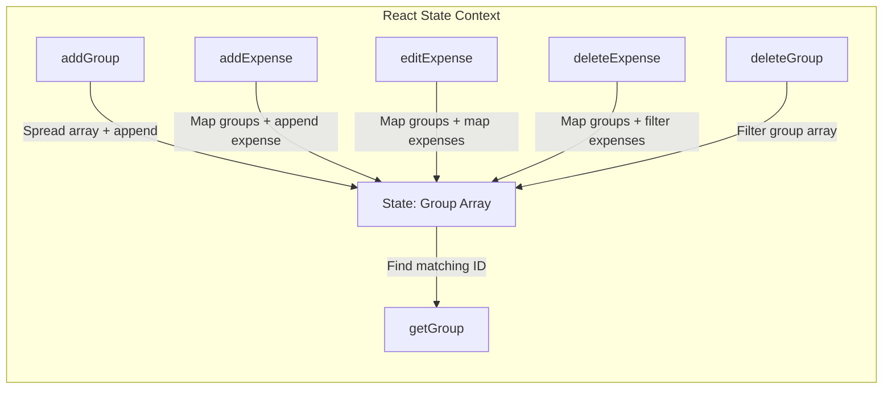
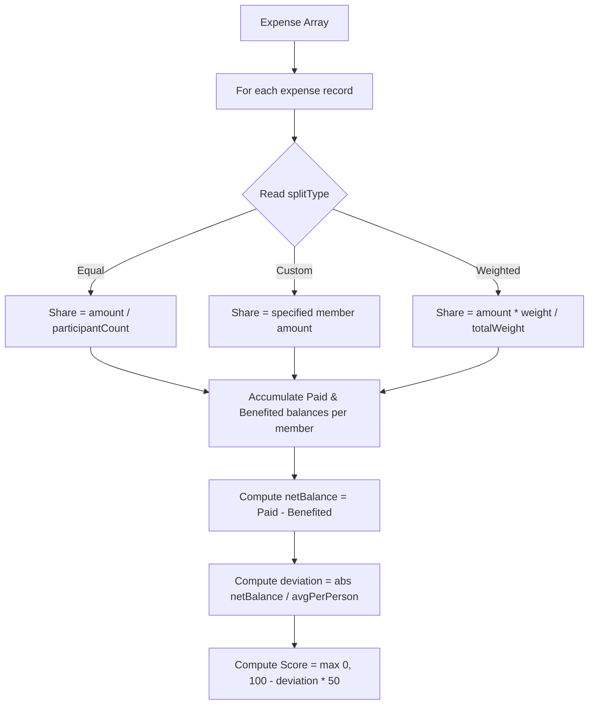
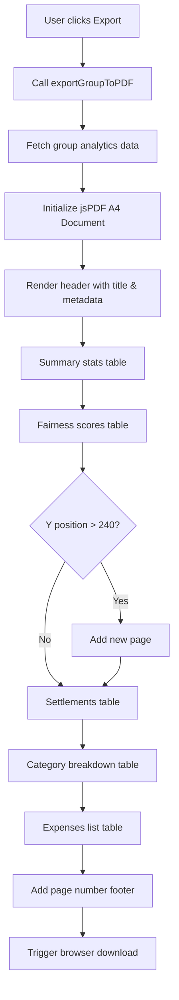
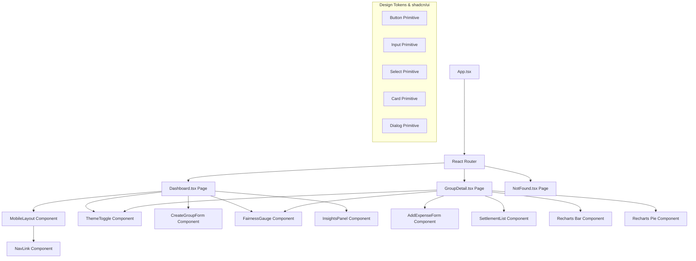
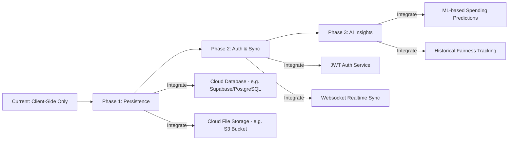

# 🏗️ FairSplit — System Architecture Design

This document details the architectural layout, core design patterns, data flow structures, algorithm specifications, and technology selections underlying **FairSplit**.

---

## 📋 Table of Contents

- [1. System Overview & Objective](#1-system-overview--objective)
- [2. Problem-Solving Approach](#2-problem-solving-approach)
  - [Mathematical Model of Fairness](#mathematical-model-of-fairness)
  - [Greedy Transaction Minimization](#greedy-transaction-minimization)
  - [Rule-Based Behavior Classification](#rule-based-behavior-classification)
- [3. High-Level Architectural Diagrams](#3-high-level-architectural-diagrams)
  - [Conceptual Component Layering](#conceptual-component-layering)
  - [System Interaction Map](#system-interaction-map)
  - [Page Request & Calculation Lifecycle](#page-request--calculation-lifecycle)
- [4. Architectural Layers](#4-architectural-layers)
  - [Presentation Layer](#presentation-layer)
  - [Component Layer](#component-layer)
  - [State Layer](#state-layer)
  - [Logic Layer](#logic-layer)
- [5. Data Flow & Execution Pipeline](#5-data-flow--execution-pipeline)
  - [Complete Data Flow Diagram](#complete-data-flow-diagram)
  - [State Mutation Pattern](#state-mutation-pattern)
- [6. Algorithmic Processing Engine](#6-algorithmic-processing-engine)
  - [Fairness Score Pipeline](#fairness-score-pipeline)
  - [Greedy Settlement Optimizer](#greedy-settlement-optimizer)
- [7. PDF Export System Pipeline](#7-pdf-export-system-pipeline)
- [8. Component Hierarchy & Layout Tree](#8-component-hierarchy--layout-tree)
- [9. Technical Stack & Rationale](#9-technical-stack--rationale)
  - [Tech Stack Selection](#tech-stack-selection)
  - [Architectural Pros & Cons](#architectural-pros--cons)
- [10. Scalability & Future Production Considerations](#10-scalability--future-production-considerations)

---

## 1. System Overview & Objective

FairSplit is designed as a serverless, client-side **Single Page Application (SPA)** that tracks expenses and evaluates social equity within shared groups. Unlike conventional tools that stop at basic splitting calculations, FairSplit measures contribution equity using fairness scores, analyzes group behaviors, suggests transaction-optimized settlements, and exports records to PDF.

### Key Objectives
- **Quantifiable Metrics**: Deliver mathematical proof of group expense balance.
- **Client-Side Independence**: Handle all math, routing, graphics, and report exports locally in the browser sandbox.
- **Micro-Interactions**: Use fluid circular SVG gauges, charts, and layout transitions.

---

## 2. Problem-Solving Approach

FairSplit models the social and financial dynamics of group expenses using three core methods:

### Mathematical Model of Fairness
Groups often have members with varying financial involvement. FairSplit defines fairness as the deviation between a member's total financial output ($\text{Paid}$) and their consumed benefit ($\text{Benefited}$). By normalizing the absolute deviation against the group's average per-person expenditure, the engine converts raw currency differences into a standardized $0\text{--}100$ score, allowing groups to compare their balance across different spending levels.

### Greedy Transaction Minimization
A common problem in group payments is "debt loops" (e.g., A owes B, B owes C, C owes A). Rather than executing multiple small transactions, the engine models the group as a financial network. It consolidates net balances, separates debtors from creditors, and matches them greedily starting with the largest imbalances. This approach resolves all debts in a near-optimal set of $M-1$ transactions.

### Rule-Based Behavior Classification
Social imbalances, like "free-riding" or "over-paying," can strain group dynamics. The engine runs heuristic checks across the group's transaction history to flag these patterns. By analyzing ratios (such as paying less than 20% of the average while consuming over 50%), it warns groups of structural imbalances early.

---

## 3. High-Level Architectural Diagrams

### Conceptual Component Layering

FairSplit organizes UI components, state management, and business logic into distinct layers:



### System Interaction Map

This map shows how user inputs flow through the application state to trigger UI rendering and PDF generation:



### Page Request & Calculation Lifecycle



---

## 4. Architectural Layers

### Presentation Layer (`src/pages/`)
Contains the page-level views mapped to routes:
- `Dashboard.tsx`: Renders overall statistics, global behavioral insights, and the list of active groups.
- `GroupDetail.tsx`: Renders detailed charts, fairness gauges, settlement paths, and the transaction ledger for a specific group.
- `NotFound.tsx`: A fallback screen for unresolved URL paths.

### Component Layer (`src/components/`)
Handles layout and input controls:
- `MobileLayout`: Manages the viewport shell, bottom navigation tabs, and the mobile Action Button.
- `CreateGroupForm`: Wizard for creating groups and managing member profiles.
- `AddExpenseForm`: Form for entering expenses, choosing split types (Equal, Custom, or Weighted), and uploading receipts.
- `FairnessGauge`: Displays individual scores using an animated SVG circle.
- `ThemeToggle`: Manages Light and Dark mode options.

### State Layer (`src/context/`)
Manages application state and CRUD APIs:
- `AppContext.tsx`: Uses React state to manage groups, members, and expenses. It exposes handlers to add, edit, or delete items, ensuring updates cascade to all subscribing views.

### Logic Layer (`src/lib/`)
Stateless TypeScript utility modules:
- `fairness-engine.ts`: Computes balances, scores, and optimized settlements.
- `behavior-analysis.ts`: Evaluates group records against rules to identify spending patterns.
- `export-pdf.ts`: Formats and generates downloadable PDF reports.
- `types.ts`: Holds shared TypeScript types.

---

## 5. Data Flow & Execution Pipeline

### Complete Data Flow Diagram



### State Mutation Pattern

State changes in `AppContext.tsx` use immutable updates to ensure React reliably detects changes and updates the UI:



---

## 6. Algorithmic Processing Engine

### Fairness Score Pipeline



### Greedy Settlement Optimizer

```mermaid
graph TD
    A[Compute net balances per member] --> B[Filter members with non-zero balances]
    B --> C[Divide into Debtors (balance < 0) & Creditors (balance > 0)]
    C --> D[Sort both lists by amount descending]
    C --> E{Are both lists non-empty?}
    E -->|Yes| F[Match largest debtor with largest creditor]
    F --> G[Determine transfer amount = min(debt, credit)]
    G --> H[Create Settlement transaction record]
    H --> I[Subtract transfer amount from debtor's and creditor's balances]
    I --> J[Remove members from lists if remaining balance = 0]
    J --> E
    E -->|No| K[Return minimal Settlement list]
```

---

## 7. PDF Export System Pipeline

The PDF export system uses `jsPDF` and `jspdf-autotable` to format and render reports:



---

## 8. Component Hierarchy & Layout Tree

The visual composition tree shows the routing and component hierarchy:



---

## 9. Technical Stack & Rationale

### Tech Stack Selection
- **Vite 5**: Selected over standard Webpack configurations for faster hot-reloading (HMR) and optimized ES-module building, which helps keep the production bundle small.
- **Tailwind CSS 3**: Selected to implement responsive grid layouts, custom dark mode states, and glassmorphism elements using utility classes.
- **Recharts**: Selected for its declarative API, which integrates naturally with React's state model compared to manual DOM manipulation.
- **jsPDF + AutoTable**: Selected to handle document construction entirely in the browser, removing the need for a backend PDF generation service.

### Architectural Pros & Cons

#### Pros
- **Zero Server Overhead**: The application does not require a running backend to calculate splits, verify entries, or export reports, making it free to host on static networks.
- **Responsive Layout**: Designed for mobile viewports using bottom navigation elements and touch targets, while scaling to multi-column grid layouts on desktop viewports.
- **Fast UI Rendering**: Local state processing ensures charts and fairness gauges update instantly as expenses are added or removed.

#### Cons
- **Local-Only Persistence**: Since data is managed in React state (and initially seeded from sample data), refresh operations revert modifications.
- **Non-Persistent File Uploads**: Attached receipt images are stored as local blob URLs that expire when the browser tab is closed.
- **No Multi-User Sync**: The app is designed for single-device simulation rather than real-time collaboration.

---

## 10. Scalability & Future Production Considerations

To scale FairSplit for production, the architecture can be updated from local state to a cloud-backed model:



1. **Phase 1: Cloud Database**: Replace the local context state with a database client (e.g., Supabase or a custom API) to store groups, members, and expenses.
2. **Phase 2: Authentication & Sync**: Implement user accounts and JWT authentication to protect data and sync records across devices.
3. **Phase 3: File Storage**: Move receipt attachments from local blob URLs to a cloud storage bucket to ensure images persist across sessions.
4. **Phase 4: Optimization**: Offload computation for large groups to edge functions or backend services to keep the client UI responsive.

---

<div align="center">

**[← Back to README](README.md) · [Complete Project Documentation →](projectdocumentation.md)**

</div>
