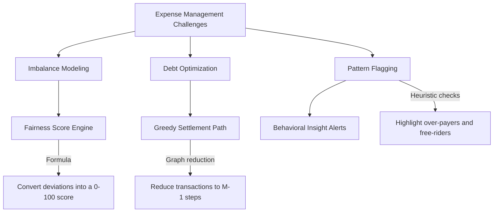
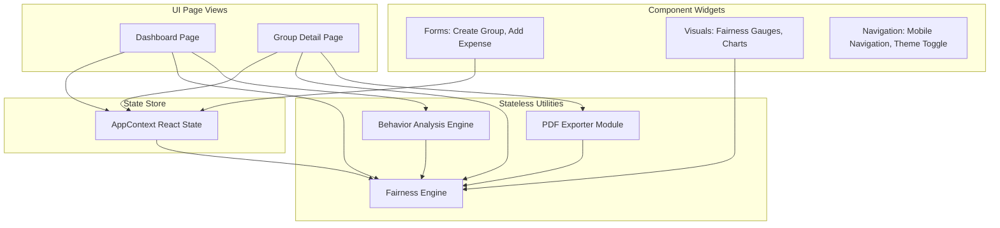
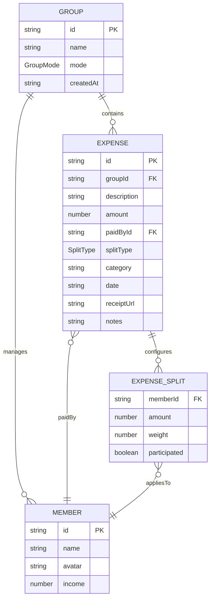
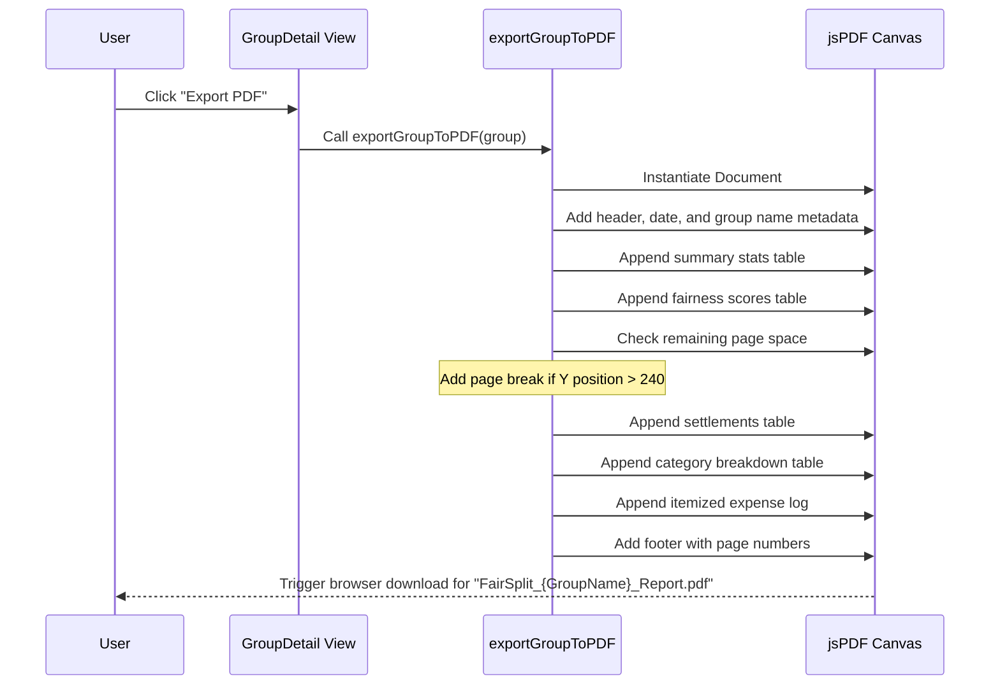
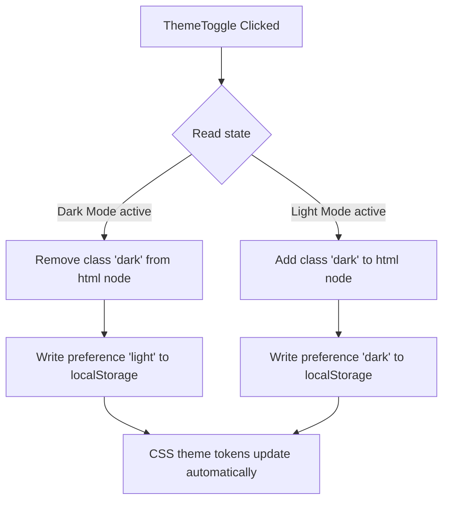

# 📘 FairSplit — Complete Project Documentation

This document provides comprehensive technical documentation for **FairSplit**, covering system design, algorithmic logic, data structures, UI layouts, and testing methodologies.

---

## 📋 Table of Contents

- [1. Executive Summary & Objective](#1-executive-summary--objective)
- [2. Problem Statement](#2-problem-statement)
- [3. Problem-Solving Approach](#3-problem-solving-approach)
- [4. High-Level System Architecture](#4-high-level-system-architecture)
- [5. Module Breakdown & Responsibilities](#5-module-breakdown--responsibilities)
- [6. Data Models & Entities](#6-data-models--entities)
- [7. Fairness Engine Deep Dive](#7-fairness-engine-deep-dive)
- [8. Behavior Analysis Engine Rules](#8-behavior-analysis-engine-rules)
- [9. Client-Side PDF Export System](#9-client-side-pdf-export-system)
- [10. Adaptive UI/UX & Responsive Layouts](#10-adaptive-uiux--responsive-layouts)
- [11. Theme Management System](#11-theme-management-system)
- [12. Technical Advantages, Benefits, Pros & Cons](#12-technical-advantages-benefits-pros--cons)
- [13. Testing & Validation Strategy](#13-testing--validation-strategy)
- [14. Production Deployment Guide](#14-production-deployment-guide)

---

## 1. Executive Summary & Objective

**FairSplit** is a client-side web application designed to track shared group expenses and evaluate social equity. While typical bill-splitters calculate the cash transfers required to settle balances, they do not measure whether the spending and consumption patterns are equitable.

FairSplit introduces a **Fairness Score Engine (0–100)** to evaluate contributions relative to benefits. It runs heuristic checks to flag spending imbalances (such as consistent over-payers or free-riders), provides transaction-optimized settlement plans, and exports detailed summaries directly to PDF reports.

---

## 2. Problem Statement

Shared finances in travel groups, shared living spaces, or events often cause friction due to several factors:

1. **Perception Bias**: Group members often feel they have contributed more than their fair share, leading to trust issues.
2. **Splitting Imbalances**: Traditional equal splits do not reflect cases where some members consume less or have different weights (e.g., guests vs. full-time occupants).
3. **Settlement Inefficiency**: Unoptimized settlement plans generate too many peer-to-peer transactions, adding complexity.
4. **Lack of Analytics**: Static ledgers do not highlight long-term spending patterns or group imbalances.
5. **No Records**: Teams lack simple tools to export professional, offline PDF summaries of group finances.

---

## 3. Problem-Solving Approach

FairSplit models the social and financial dynamics of group expenses using three core methods:



---

## 4. High-Level System Architecture

FairSplit is designed as a serverless Single Page Application (SPA). All computations, charts, theme transitions, and PDF report compiles occur in the client browser.



---

## 5. Module Breakdown & Responsibilities

### 5.1 Fairness Engine (`src/lib/fairness-engine.ts`)
Calculates the group's financial metrics:
- `calculateMemberBalances`: Sums the total paid and benefited amounts for each member.
- `calculateFairnessScores`: Computes individual equity scores based on their deviation from the group average.
- `calculateSettlements`: Runs the greedy transaction minimization algorithm.
- `calculateGroupAnalytics`: Consolidates scores, settlements, category totals, and top payers into a single payload.

### 5.2 Behavior Analysis (`src/lib/behavior-analysis.ts`)
Analyzes group history to flag spending patterns:
- Runs heuristic checks across all groups.
- Generates categorized alerts (`alert`, `warning`, `info`, `success`) to highlight imbalances like over-paying or free-riding.

### 5.3 PDF Exporter (`src/lib/export-pdf.ts`)
Handles client-side PDF document layout:
- Instantiates a `jsPDF` canvas.
- Renders tables for summary statistics, member scores, settlements, category breakdowns, and the full transaction log.

### 5.4 State Provider (`src/context/AppContext.tsx`)
Exposes state and CRUD APIs:
- Manages the `groups` array in React state.
- Exposes immutable update handlers: `addGroup`, `deleteGroup`, `addExpense`, `editExpense`, and `deleteExpense`.

---

## 6. Data Models & Entities

The entity relationship diagram below details the structure of our domain types:



---

## 7. Fairness Engine Deep Dive

### Step 1: Balance Compilation
The engine loops through the group's expense records. For each expense, it credits the payer's `paid` balance and distributes the consumption cost to participants' `benefited` balances based on the split configuration:
- **Equal Split**: Cost is divided evenly among participants.
- **Custom Split**: Uses the specific amount set for each participant.
- **Weighted Split**: Share is determined by the participant's weight relative to the group's total weight.

### Step 2: Score Calculation
The individual fairness score measures how close a member's total payments are to their consumed benefits.

$$\text{Net Balance}_i = \text{Paid}_i - \text{Benefited}_i$$

$$\text{Deviation}_i = \frac{|\text{Net Balance}_i|}{\text{Average Expenditure Per Person}}$$

$$\text{Fairness Score}_i = \max\left(0, 100 - \text{Deviation}_i \times 50\right)$$

- **0% deviation**: Score of **100** (perfect equity).
- **100% deviation**: Score of **50** (concerning imbalance).
- **200% deviation**: Score of **0** (extreme imbalance).

The overall group fairness score is the average of all member scores.

### Step 3: Greedy Settlement Optimization
To resolve debts with the fewest transactions, the engine separates debtors (net balance $< 0$) from creditors (net balance $> 0$) and sorts both lists by absolute values. It greedily matches the largest debtor with the largest creditor, transfers the maximum possible amount to resolve one of the balances, and repeats the process until all balances are settled.

```mermaid
graph TD
    A[Compute member net balances] --> B[Filter members with non-zero balances]
    B --> C[Separate into Debtors & Creditors]
    C --> D[Sort lists descending by amount]
    D --> E{Are both lists non-empty?}
    E -->|Yes| F[Match largest debtor with largest creditor]
    F --> G[Determine transfer amount = min(debt, credit)]
    G --> H[Create Settlement transaction record]
    H --> I[Subtract transfer amount from debtor's and creditor's balances]
    I --> J[Remove members from lists if remaining balance = 0]
    J --> E
    E -->|No| K[Return minimal Settlement list]
```

---

## 8. Behavior Analysis Engine Rules

The behavior engine monitors group metrics to flag spend behaviors:

| Alert Category | Severity | Detection Heuristic |
| :--- | :--- | :--- |
| **Consistent Over-payer** | Warning 💸 | `Paid > avgPerPerson * 1.4` AND `netBalance > avgPerPerson * 0.3` |
| **Free-rider** | Alert 🚩 | `Benefited > avgPerPerson * 0.5` AND `Paid < avgPerPerson * 0.2` |
| **Dominant Payer** | Info 👑 | Single member pays $>60\%$ of total group costs across $\ge 3$ expenses |
| **Well-Balanced** | Success ✅ | All members maintain a fairness score $\ge 80$ across $\ge 3$ expenses |
| **Category Spike** | Info 📊 | Spending in a single category accounts for $>60\%$ of total group costs |
| **Large Expense** | Warning ⚠️ | A single expense accounts for $>50\%$ of total group costs across $\ge 3$ expenses |

---

## 9. Client-Side PDF Export System

The export module compiles group data into a formatted PDF using `jsPDF` and `jspdf-autotable`. The rendering pipeline operates as follows:



---

## 10. Adaptive UI/UX & Responsive Layouts

FairSplit uses a mobile-first design that adapts to different viewports:

### Mobile Layout (< 768px)
- **Navigation**: Uses a fixed bottom navigation bar with easy-access tabs for Home, Insights, and Statistics.
- **Controls**: Includes a floating action button (FAB) for quick group creation and touch targets of at least 44px.
- **Styling**: Features single-column layouts and compact text spacing to prevent horizontal scrolling.

### Tablet & Desktop Layout ($\ge$ 768px)
- **Navigation**: The bottom navigation bar is hidden in favor of standard header links.
- **Grid Layout**: Displays analytics cards, charts, and transaction ledgers in a multi-column grid.
- **Hover Effects**: Buttons and action icons display hover states for improved desktop navigation.

---

## 11. Theme Management System

The application supports Light and Dark modes. The system checks for user preferences and updates the UI:



CSS variables dynamically adjust background, container, border, text, and interactive states based on the active theme.

---

## 12. Technical Advantages, Benefits, Pros & Cons

### Advantages & Benefits
- **Quantitative Equity**: Converts complex spending imbalances into an intuitive 0–100 score.
- **Private & Serverless**: Runs entirely in the client browser, securing user data and eliminating server hosting costs.
- **Responsive Animations**: Uses Framer Motion transitions and circular SVG gauges to deliver visual feedback.
- **Extensible Architecture**: The stateless, pure-functional calculation engine makes it easy to add new split types or behavioral rules.

### Pros & Cons

#### Pros
- High-speed updates due to client-side state processing.
- Clean separation of UI components from core financial calculation logic.
- Automated client-side PDF generation that does not require a backend service.
- Out-of-the-box styling support for both dark and light modes.

#### Cons
- Data is stored in local React state and reset on page reload.
- Attached receipt files are converted to local blob URLs that expire when the session ends.
- Lacks database synchronization and support for collaborative, multi-device editing.

---

## 13. Testing & Validation Strategy

Our testing strategy ensures the application remains reliable as features are added:

### Unit Testing (Vitest)
Unit tests verify core calculations in the logic layer:
- **Split Modes**: Verifies calculations for equal, custom, and weighted splits.
- **Settlement Minimization**: Verifies that greedy settlement calculations result in zero-sum net balances.
- **Insights Engine**: Verifies pattern triggers against boundary cases (e.g., exactly at the 60% spending threshold).

Run the unit test suite:
```bash
npm test
```

### Manual QA Checklist
Before deploying changes, verify the following:
- Create a group, add members, and verify they display in the selection menus.
- Log expenses using equal, custom, and weighted splits, checking that calculations are correct.
- Verify the circular fairness gauge color matches the score range (green, yellow, or red).
- Toggle dark/light modes and reload the page to ensure theme preferences persist.
- Generate and download the PDF report, verifying all tables and logs render correctly.

---

## 14. Production Deployment Guide

### Build Compilation
To compile the source files and generate an optimized production bundle in the `dist/` directory, run:
```bash
npm run build
```

### Local Preview
To preview the compiled production assets locally, run:
```bash
npm run preview
```

### Deployment Options
Since FairSplit builds into static HTML, CSS, and JS assets, it can be deployed to static hosting platforms such as Vercel, Netlify, Github Pages, or Cloudflare Pages without additional server configuration.

---

<div align="center">

**[← Back to README](README.md) · [Architecture Design →](architecture.md)**

</div>
